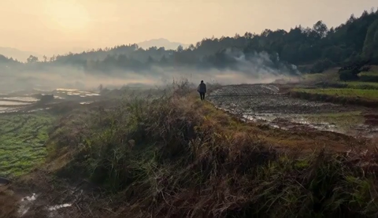

# 🎬 出片台 VideoStudio

面向非技术创作者的一键出视频系统：本地运行，把「一个想法」变成「一段成片」。

基于 ComfyUI 的图生视频 / 文生视频能力做了完整封装，并补齐了 AI 视频生产的「最后一公里」——角色一致性、多段自动接续、夜间批量产线、自动质检闭环、1080p 终化，全部跑在 8GB 显存笔记本上。

<p align="center">
  
</p>

<p align="center"><em>▲ 由出片台生成的视频片段（本地 8GB 显存，MiniMax H3 模型）</em></p>

---

## 解决什么问题

- **ComfyUI 太专业**：节点图、模型文件、采样参数……普通人根本看不懂
- **AI 出片没有「工程」**：一张图生一段视频很容易，但角色一致性、多段拼接、字幕烧录、批量产出这些「最后一公里」没人管
- 出片台就是把这一段补齐：**人只做「选择」和「下指令」**，其余全部自动完成

## 系统架构

```
用户想法
  │
  ▼
本地编剧（Ollama qwen3.8，不出云）── 写完整故事
  │
  ▼
进度窗口拆镜（每批发 1/8 剧本，控制上下文不爆）
  │
  ▼
角色锚解析（三来源：自动抽卡 / 角色库选卡 / 上传图）
  │
  ▼
分镜审查（human-in-loop：用户可对任意镜提意见，AI 改写后继续）
  │
  ▼
H3 ref2va 逐镜生成（参考图全程注意力，角色/场景不漂移）
  │
  ▼
交叉溶解拼接（xfade 单 pass，避免二次编码损失）
  │
  ▼
1080p 升采样（lanczos + unsharp，只重编码一次）
  │
  ▼
最终成片
```

**技术栈**：FastAPI + 纯 HTML/JS 前端（无构建）+ ComfyUI 引擎（Wan 2.2 / MiniMax H3 双模型可切换）

## 核心工程能力

### 角色一致性（ref2va 全程注意力）

传统 i2v 只做首帧锚定，注意力随时间衰减 → 角色后面就漂移。
出片台用 **MiniMax H3 的 ref2va 节点**：参考图 token 全程参与每一步采样，角色/场景锁定整段。

四种锚定方式：
1. **自动抽卡**：生成 4 个候选迷你视频，本地视觉模型选最清晰的一张
2. **角色库选卡**：从本地资料库选已定妆的角色（跨片复用）
3. **按描述生成**：一句话 → 本地文生图 4 候选 → 点选 → 存入角色库
4. **上传图**：任何图片直接当锚（外部角色、真人照片）

### 夜间批量产线（无人值守）

长任务走离线脚本，整晚挂上，早上出片：

| 能力 | 实现 |
|---|---|
| **断点续跑** | 启动时扫描 `output/` + ComfyUI 产物，自动吸收已有段，只补缺（幂等） |
| **OOM 自愈** | H3 在 8GB 显存偶发 CUDA-OOM 且整个 ComfyUI 进程静默死掉，产线检测到 `is_ready()=False` 后自动重启引擎再重试 |
| **桌宠控制** | 双击暂停/继续、右键结束；产线轮询 `_control.txt`（RUN/PAUSE/STOP），暂停保住已算完的段 |
| **进度监控** | 命令行轮询引擎日志，解析 tqdm 采样进度；桌宠悬停气泡显示同数据 |

### ASR 自动质检闭环（语音驱动视频）

用于「演讲转视频」产线：每段生成后自动跑 faster-whisper 转写，与原文计算 **手写 Levenshtein CER**，超阈值（CER > 25%）自动换 seed 重做，最多重试 5 次。

```
生成段 → ASR 转写 → CER 比对 → 不合格 → 换 seed 重做（×5）
                                   → 合格 → 写入成片
```

帧数由 TTS 时长驱动（**视频时长 ≤ 音频时长**），音频紧凑覆盖全程 → 模型逐字复述，音画同步天然成立。

### ffmpeg 终化管线

- **交叉溶解拼接**：单 pass 链式 `xfade`（累加 offset 精确计算），避免二次编码损失
- **1080p 升采样**：`lanczos + force_original_aspect_ratio=increase + crop`（不拉伸变形）+ `unsharp` 轻度锐化，`CRF 18 slow` 近无损
- **中文字幕烧录**：`filter_complex_script` 文件 + `cwd` 切换，规避 Windows 路径转义（冒号/盘符全是坑）

## 实测参数（8GB 显存）

| 配置 | 单段耗时 | 帧数 |
|---|---|---|
| Wan 2.2 i2v（4 步 LightX2V 蒸馏） | ~25 min | 124 帧 |
| MiniMax H3 t2v/i2v（20 步 euler+beta） | ~25 min | 124 帧 |
| H3 高清重跑（1024×576，81 帧） | ~55 min | 81 帧 |

> OOM 边界：124 帧 640×832 是 8GB 上限，175 帧必 OOM；`--reserve-vram 0.3`（离线批量）实测能扛住 124 帧

## 快速开始

```bash
# 前置：ComfyUI 在 D:\ComfyUI_Wan（端口 8188），Ollama 本机运行 qwen2.5vl:7b

# 复制密钥模板
cp local_config.example.py local_config.py   # 填入 DeepSeek API Key

# 一键启动（自动拉起引擎 + 后端 + 浏览器）
run.bat
# 或手动访问 http://127.0.0.1:8000/
```

**离线批量跑（不用开 run.bat）**：

```bash
D:\ComfyUI_Wan\run_comfyui.bat    # 引擎
python _run_batch_seg2to10.py      # 批量产线（断点续跑）
python _monitor_progress.py 30     # 命令行看进度
```

## 目录结构

```
web/                          前端（HTML+JS，无构建）
api/  service/  db/  shared/  分层业务代码（调用铁律：api → service → db）
workflows/                    ComfyUI 节点图（Wan i2v/t2v、H3、角色卡、Qwen 三视图）
_pet.py                       桌宠（悬浮窗，控制批量产线）
_run_batch_seg2to10.py        离线批量产线（幂等断点续跑 + OOM 自愈）
_kangbo_v4_pipeline.py        演讲转视频产线（ASR 质检 + TTS 时长驱动帧数）
_finalize_1080p.py            交叉溶解拼接 + 1080p 升采样
_upscale_realesrgan.py        Real-ESRGAN 本地超分（逐帧，可断点续跑）
archive/                      已完成任务留档
```

## License

MIT
